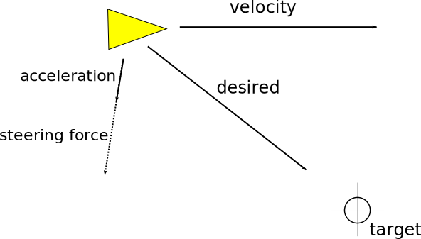

All kinds of steering strategies exist and depend on what effect you are trying to achieve. In our example, the boids apply a small acceleration in whichever direction the ruleset tells them to go in.

In our case, we want our boids to make an "intelligent" decision to steer towards a target point based on its perception of its state and environment.

# Locomotion

We will implement a minimalistic physics engine for our boids to move around in.

We start by giving our Boid a physical presence with a **position**, a **velocity** and an **acceleration** vector.

```javascript
function Boid() {
	this.position = new Victor(0,0);
	this.velocity = new Victor(0,0);
	this.acceleration = new Victor(0,0);
}
```
💡 _You may wish to add **mass** to your boids too if you're going for a more advanced engine._

Each **tick** of the engine, we'll want to update the speed and position of each boid.


```javascript
Boid.prototype.update = function() {
	// Update velocity
	// TODO TEST!
	this.velocity.add(this.acceleration);	

	// Apply velocity to position
	this.position.add(this.velocity);

	// Reset acceleration
	this.acceleration.zero();
}
```

An acceleration force will be applied continually to the boid. To limit its speed we can simulate friction by multiplying the velocity by a coefficient contained in the range `[0;1]`.

```javascript
	var friction = 0.01;
	// Apply friction
	this.velocity.multiplyScalar(1 - friction);
```
💡 _The boid's current friction could be based on its position in the environment. Maybe you want patches of mud or ice?_

# Steering

Our boid can now advance by accelerating. It still needs to decide _how_ it will accelerate.

This decision can be based on a **goal**. You can think of a boid's goal as a **desired velocity**.

[Craig Reynolds](https://en.wikipedia.org/wiki/Craig_Reynolds_(computer_graphics)) defined the following steering strategy `steering force = desired velocity - current velocity`.

```javascript
Boid.prototype.steer = function(desired) {
	return desired.subtract(this.velocity);
}
```

This will make our boids jump straight into the desired velocity. However, we can limit how strong their acceleration can be for more fluid, natural movement.

```javascript
function limitForce(vector) {
	var maxForce = 0.05;
	if (vector.length() > maxForce) {
		vector.normalize().multiplyScalar(maxForce);
	}
	return vector;
}
```

💡 _You could also get your boids to accelerate at max force regardless of the length of the destination velocity. This might make some boids appear to get over-excited at times._

# In summary

* Craig Reynold's steer function gives us a vector to get from one velocity vector to another. This is the `steering force`.
* We want to simulate natural movement in our boids so we limit that force by a `max force` variable.
* The resulting vector becomes the boid's `acceleration`.



# Hands on

Try to complete the code below to achieve a steering strategy in your boid as described above. The boid's desired speed vector will be given to the `steer()` function which must return the appropriate steering force.

📐 Here, the desired speed is set to `6` pixels per step. There are approximately `60` steps per second.
Adjust the friction and max acceleration force accordingly. For instance, if the maxForce if `0.01` and friction is `0`, your boid will reach desired velocity in `600` steps (~`10` seconds).

@[Steering]({
	"command": "sh run.sh steering",
	"stubs": ["steering/todo.js", "steering/core.js"]
})

You can try changing the steering strategy and see how your boid compares to the sample boid.

💡 _If you increase the desired speed in `steer()` but use the same implementation, you can get a less slow yet similar result._
